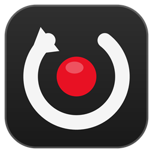

<div align="center">



# ClipBar

**Запись экрана для Windows с мгновенным повтором.**
Как ShadowPlay и Game Bar — только лёгкая, для всего рабочего стола и с нормальным редактором.

by **@lumaseller**

[](https://github.com/null-byte00/ClipBar/releases/latest)
[](https://github.com/null-byte00/ClipBar/releases)


### [Скачать установщик](https://github.com/null-byte00/ClipBar/releases/latest)

</div>

<br>

## Возможности

<table>
<tr>
<td width="50%" valign="top">

### Мгновенный повтор
В фоне всегда хранятся последние минуты экрана — от 15 секунд до часа.
`Alt+F10` сохраняет клип за 1–2 секунды, без перекодирования.
После сохранения буфер начинается заново, повторы не дублируются.

</td>
<td width="50%" valign="top">

### Оверлей `Alt+Z`
Панель в стиле GeForce Experience: повтор («последние 30 сек / 1 мин / 2 мин / всё»),
запись, скриншот, громкость, последние клипы и скриншоты.
Галерея и редактор открываются прямо поверх игры.

</td>
</tr>
<tr>
<td valign="top">

### Редактор
Обрезка по кадрам, лента кадров и волна звука.
Экспорт для Discord (до 10 МБ), TikTok / Shorts (9:16), GIF и MP3.
Громкость системы и микрофона меняется на лету, прямо при прослушивании — до 400%.

</td>
<td valign="top">

### Скриншоты как в Lightshot
`Win+Shift+S` или `PrintScreen`: выдели область, двигай и растягивай рамку.
Карандаш, маркер, линии, стрелки, рамки, текст и замазка ников и переписок.
Копировать, сохранить или «Сохранить как» в PNG / JPG.

</td>
</tr>
<tr>
<td valign="top">

### Раздельный звук
В каждом клипе три дорожки: микс, звук системы и микрофон.
Плееры и мессенджеры играют микс, а в редакторе дорожки сводятся заново.

</td>
<td valign="top">

### Почти не нагружает ПК
Захват через Desktop Duplication, кодирует видеокарта:
Intel Quick Sync, NVIDIA NVENC или AMD AMF — выбирается автоматически.
Запись 1080p60 на Intel Arc A380 — около 1–2% процессора.

</td>
</tr>
</table>

Также: автозагрузка, трей, уведомления, автообновление с GitHub, любые горячие клавиши —
даже те, что заняты другими программами. Имена файлов берутся из заголовка окна:
`room 1 _ ViTRAL 6.0 - Discord 2026-09-24 16-09-01.mp4`.

## Горячие клавиши

| Действие | Клавиши |
|:---|:---|
| Сохранить мгновенный повтор | `Alt` + `F10` |
| Начать / остановить запись | `Alt` + `F9` |
| Оверлей: повтор, галерея, редактор | `Alt` + `Z` |
| Скриншот области | `Win` + `Shift` + `S` · `PrintScreen` |
| Скриншот всего экрана | `Alt` + `F1` |
| Микрофон вкл / выкл | `Alt` + `F8` |
| Буфер повтора вкл / выкл | `Alt` + `Shift` + `F10` |

Все сочетания меняются в **Настройки → Горячие клавиши**.

## Установка

1. Скачай `ClipBar-Setup-x.y.z.exe` со страницы [релизов](https://github.com/null-byte00/ClipBar/releases/latest).
2. Запусти. Права администратора не нужны, .NET и FFmpeg уже внутри.
3. Установщик проверит систему и предложит убрать другие скриншотеры и записывалки,
   чтобы горячие клавиши работали только в ClipBar. Без твоей галочки ничего не удаляется.

Клипы сохраняются в `Видео\Captures`. Новые версии ClipBar скачивает и ставит сам.
Удаление — через **Параметры → Приложения → ClipBar**, клипы при этом остаются.

**Требования:** Windows 10 (2004) или Windows 11, 64-bit, видеокарта с аппаратным кодированием
(без неё запись идёт на процессоре).

## Сборка из исходников

Нужен [.NET 10 SDK](https://dotnet.microsoft.com/download).

```powershell
# FFmpeg (~100 МБ) в репозиторий не входит — скачать один раз
powershell -ExecutionPolicy Bypass -File tools\get-ffmpeg.ps1

# запустить
dotnet run --project src\ClipBar

# собрать установщик в dist\
powershell -ExecutionPolicy Bypass -File build\build-installer.ps1
```

Устройство программы описано в [ARCHITECTURE.md](ARCHITECTURE.md).

## Технологии

C# · .NET 10 · WPF · [WPF-UI](https://github.com/lepoco/wpfui) · [NAudio](https://github.com/naudio/NAudio) · [H.NotifyIcon](https://github.com/HavenDV/H.NotifyIcon) · [FFmpeg](https://ffmpeg.org)

## Лицензии

ClipBar запускает [FFmpeg](https://ffmpeg.org) как отдельную программу (`tools\ffmpeg.exe`).
Это сборка [gyan.dev](https://www.gyan.dev/ffmpeg/builds/) «essentials» под лицензией **GPLv3** —
подробности в [tools/FFMPEG-LICENSE.txt](tools/FFMPEG-LICENSE.txt).

<br>

<div align="center"><sub>ClipBar by @lumaseller</sub></div>
